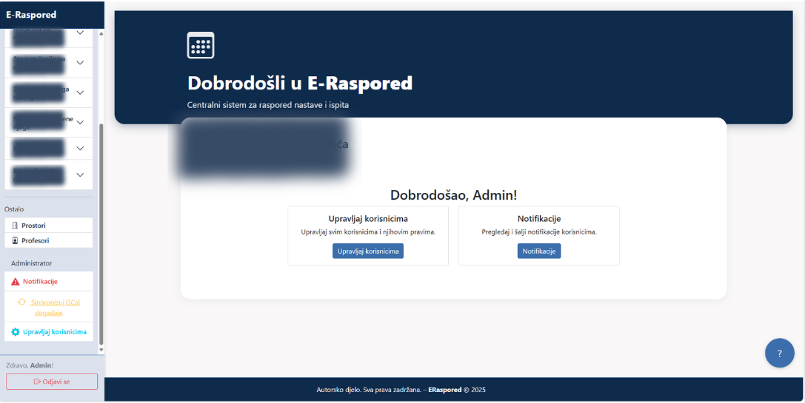
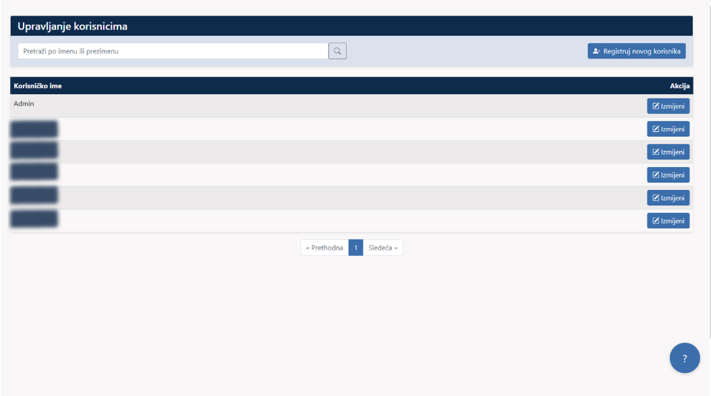
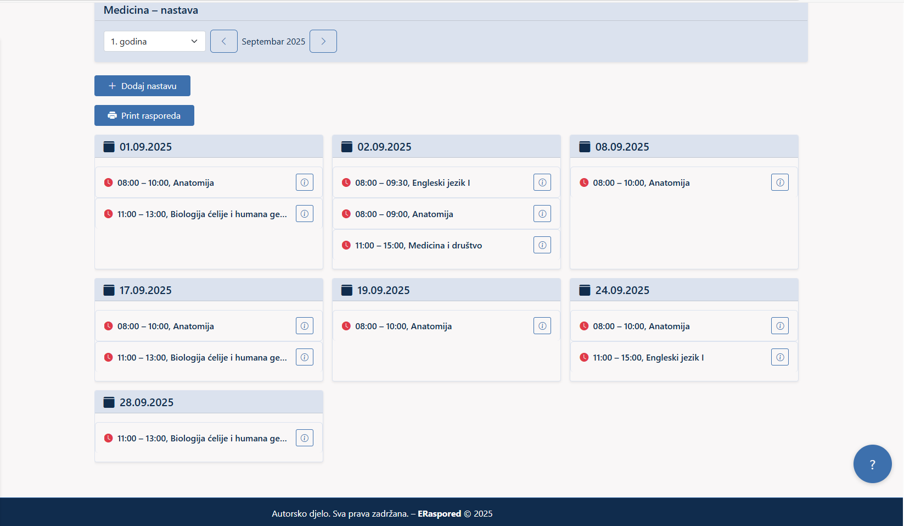
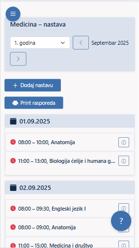
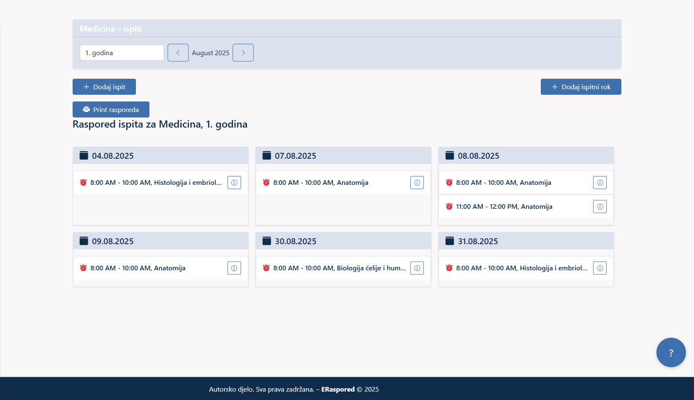
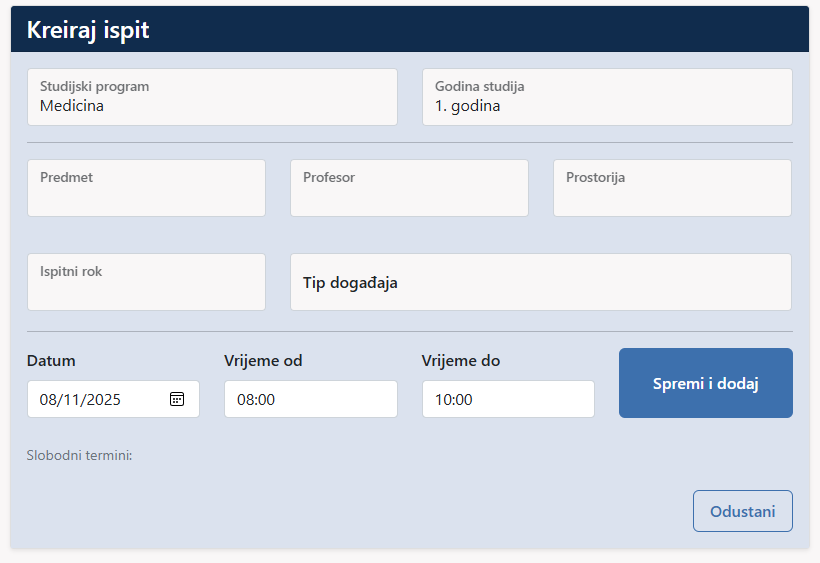
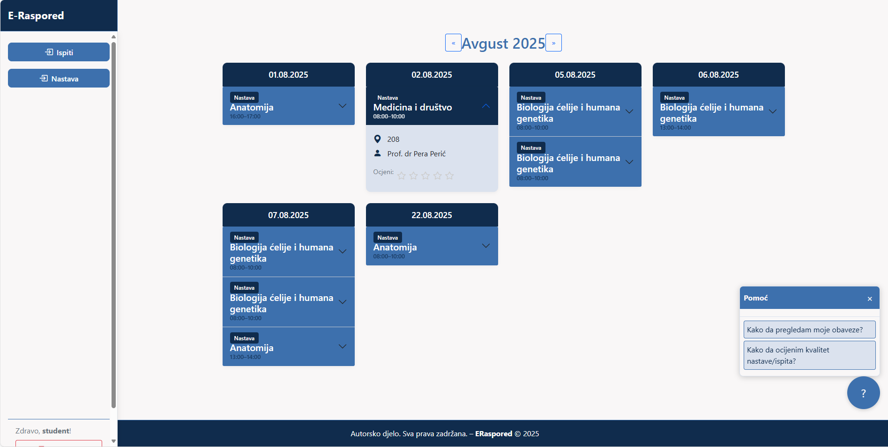
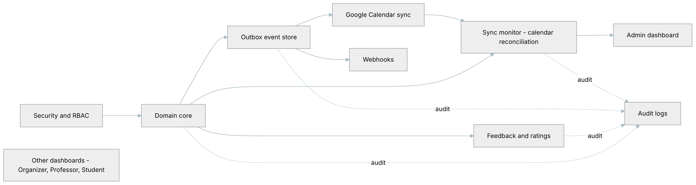
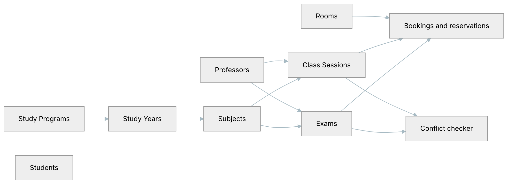
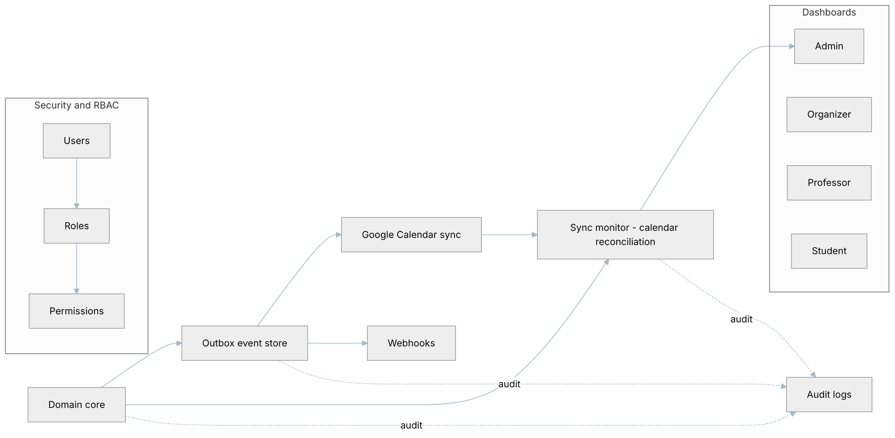

# E-Raspored — Academic Scheduling & Exam Management

E-Raspored is a modern academic scheduling system for managing classes, exams, and resources in educational institutions.  
It allows administrators, professors, and students to plan and track academic activities in one place, with Google Calendar integration.

> **Note:**  
> This repository contains **only documentation, screenshots, and demo materials**.  
> The source code is proprietary and not publicly available.

---

## 🚀 Key Features
- Centralized scheduling for classes and exams
- Conflict detection for rooms and time slots
- Two-way synchronization with Google Calendar
- Role-based access control (Admin / Organizer / Professor / Student)
- Client-side and server-side validation
- Notifications for admin
- Student feedback and rating for classes and exams
---

## 🖥️ Technologies (Production Version)
- ASP.NET Core (MVC + API)
- Entity Framework Core (SQL)
- Google Calendar API
- Bootstrap 5 (responsive UI)
- jQuery/JavaScript form validation

---

## 📸 Screenshots

<b>📊 Dashboard — click to expand</b>

 

<table>
<thead>
<tr>
<th align="center">Dashboard — Desktop</th>
<th align="center">Dashboard — Mobile</th>
</tr>
</thead>
<tbody>
<tr>
<td align="center">

</td>
<td align="center">

</td>
</tr>
</tbody>
</table>

<b>📅 Schedule — click to expand</b>

 

<table>
<thead>
<tr>
<th align="center">Schedule — Desktop</th>
<th align="center">Schedule — Mobile</th>
</tr>
</thead>
<tbody>
<tr>
<td align="center">

</td>
<td align="center">

</td>
</tr>
</tbody>
</table>

📸 Admin Dashboard

📸 Admin Users

📸 Schedule – Desktop

📸 Schedule – Mobile

📸 Exam – Overview

📸 Exam – Create

📸 Student Dashboard & Feedback & Help Widget

More in the **[screenshot gallery](media/screenshots/)**.

---

## 🎥 Demo Video
[▶ Watch the demo](media/demo.mp4)  
*(or request a live demo via email)*

---

## 🏗️ Architecture

  
<b>1) Overview</b>

  
<b>2) Core domain</b>

  
<b>3) Integrations & Ops </b>

---

## 🔒 Security Highlights
- HTTPS enforced
- Two-factor authentication on Google accounts
- Role-based permissions per module
- Data validation on multiple levels (client, server, database)
- Restricted access to Google Calendar API

---

## 📄 Documentation
- [System Overview](docs/overview.md)
- [Feature List](docs/features.md)
- [Roadmap](docs/roadmap.md)
- [FAQ](docs/faq.md)

---

## 📬 Contact
📧 Email: djordjeradovic94@gmail.com  
🌐 Demo: *(available upon request)*

---

## 📜 License
© 2025 Đorđe Radović. All rights reserved.  
This repository is for presentation purposes only. Unauthorized use, reproduction, or distribution is prohibited.
