# E-Raspored — Academic Scheduling & Exam Management

E-Raspored is a modern academic scheduling system for managing classes, exams, and resources in educational institutions.  
It allows administrators, professors, and students to plan and track academic activities in one place, with Google Calendar integration.

> **Note:**  
> This repository contains **only documentation, screenshots, and demo materials**.  
> The source code is proprietary and not publicly available.
> Who is this for & what problem it solves
eRaspored is built for three groups:
• Scheduling office / administrators – plan timetables and exams faster, detect room conflicts and lecturer workload at a glance, and coordinate changes safely.
• Teaching staff – get a filtered view of your own classes and exams, see room and group assignments, and receive notifications for changes.
• Students – see a personalized timetable (by year/group), upcoming exams, and submit quick feedback on courses and exam sessions.
The goal is to reduce manual work, prevent conflicts, and make schedules transparent for everyone.

---

## 📈 Adoption (Production Use)
- 10+ study programs
- 2,500+ students, 240+ professors
- Thousands of scheduled events per semester

## 🚀 Key Features
- Centralized scheduling for classes and exams
- Conflict detection for rooms and time slots
- Two-way synchronization with Google Calendar
- Role-based access control (Admin / Organizer / Professor / Student)
- Client-side and server-side validation
- Notifications for admin
- Student feedback and rating for classes and exams
---

## 🖥️ Technologies (Production Version)
- ASP.NET Core (MVC + API)
- Entity Framework Core (SQL)
- Google Calendar API
- Bootstrap 5 (responsive UI)
- jQuery/JavaScript form validation

---

## 📸 Screenshots

<b>📊 Dashboard — click to expand</b>

 

<table>
<thead>
<tr>
<th align="center">Dashboard — Desktop</th>
<th align="center">Dashboard — Mobile</th>
</tr>
</thead>
<tbody>
<tr>
<td align="center">
<a href="media/screenshots/01-02-Dashboard-desktop.png">
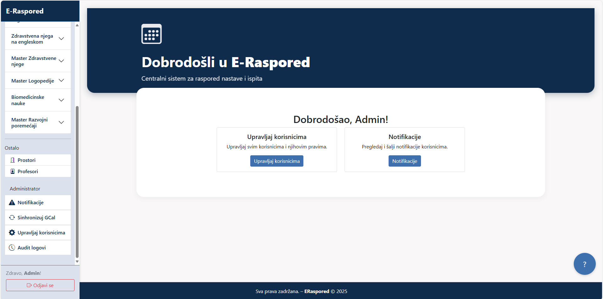
</a>
</td>
<td align="center">
<a href="media/screenshots/01-01-Dashboard-mobile.png">
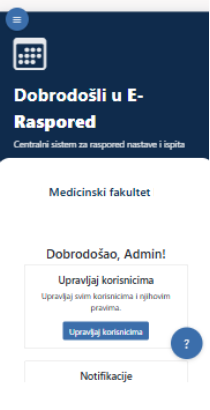
</a>
</td>
</tr>
</tbody>
</table>

<b>📅 Schedule — click to expand</b>

 

<table>
<thead>
<tr>
<th align="center">Schedule — Desktop</th>
<th align="center">Schedule — Mobile</th>
</tr>
</thead>
<tbody>
<tr>
<td align="center">
<a href="media/screenshots/02-01-Schedule-Desktop.png">
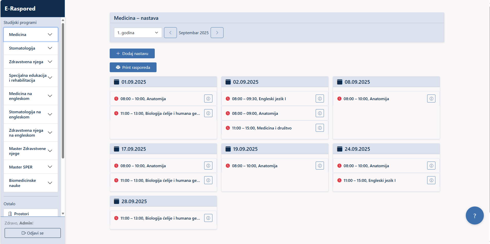
</a>
</td>
<td align="center">
<a href="media/screenshots/02-02-Schedule-mobile.png">
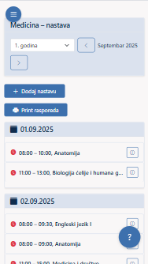
</a>
</td>
</tr>
</tbody>
</table>

<b>📝 Exam — click to expand</b>

 

<table>
<thead>
<tr>
<th align="center">Exam Create — Desktop</th>
<th align="center">Exam Options — Mobile</th>
</tr>
</thead>
<tbody>
<tr>
<td align="center">
<a href="media/screenshots/03-01-ExamCr-Desktop.png">
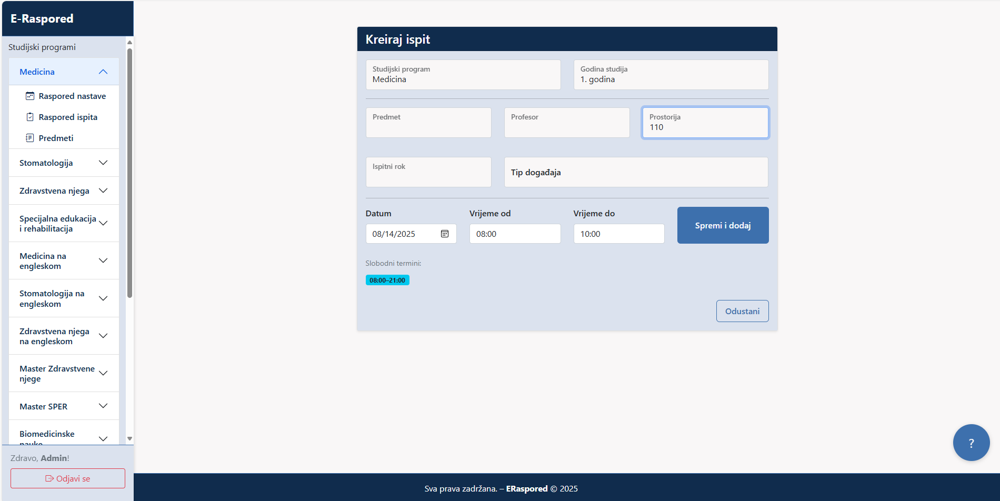
</a>
</td>
<td align="center">
<a href="media/screenshots/03-02-ExamOpt-mobile.png">
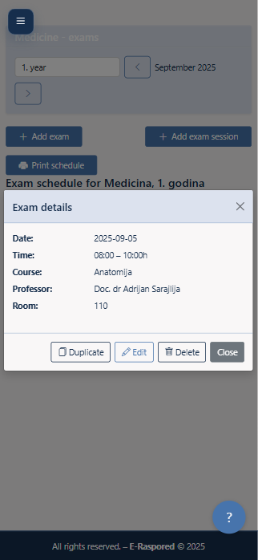
</a>
</td>
</tr>
</tbody>
</table>

<b>🧑‍🎓 Student — click to expand</b>

 

<table>
<thead>
<tr>
<th align="center">Student Dashboard — Desktop</th>
<th align="center">Student HelpWidget — Mobile</th>
</tr>
</thead>
<tbody>
<tr>
<td align="center">
<a href="media/screenshots/04-01-Student-Desktop.png">
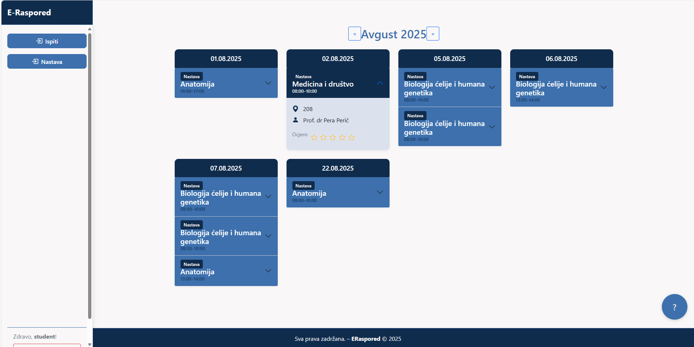
</a>
</td>
<td align="center">
<a href="media/screenshots/04-02-Student-HelpWidget-mobile.png">
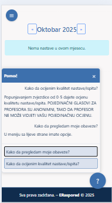
</a>
</td>
</tr>
</tbody>
</table>

<b>🖨️ Print — click to expand</b>

 

<table>
<thead>
<tr>
<th align="center">Print — Desktop</th>
</tr>
</thead>
<tbody>
<tr>
<td align="center">
<a href="media/screenshots/05-01-Print.png">
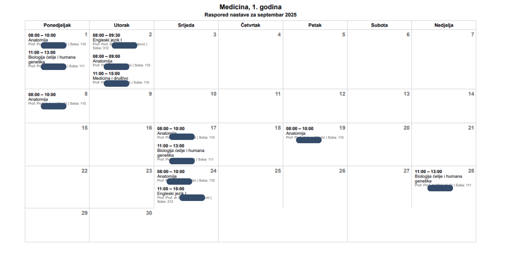
</a>
</tr>
</tbody>
</table>

<b>🛡️ Admin — click to expand</b>

 

<table>
<thead>
<tr>
<th align="center">Admin Sync GCalendar — Desktop</th>
<th align="center">Admin Notifications — Desktop</th>
<th align="center">Admin Manage Users — Mobile</th>
  <th align="center">Admin Audit Logs — Desktop</th>
</tr>
</thead>
<tbody>
<tr>
<td align="center">
<a href="media/screenshots/06-02-Admin-SyncGCal.png">
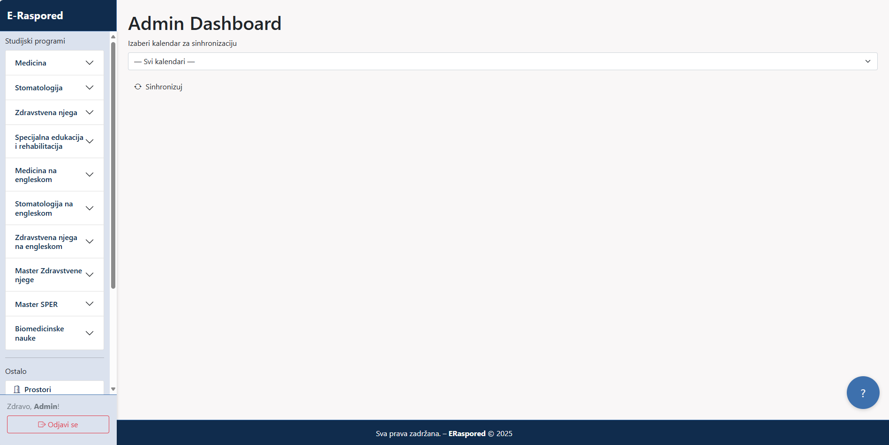
</a>
</td>
  <td align="center">
<a href="media/screenshots/06-03-Admin-Not.png">
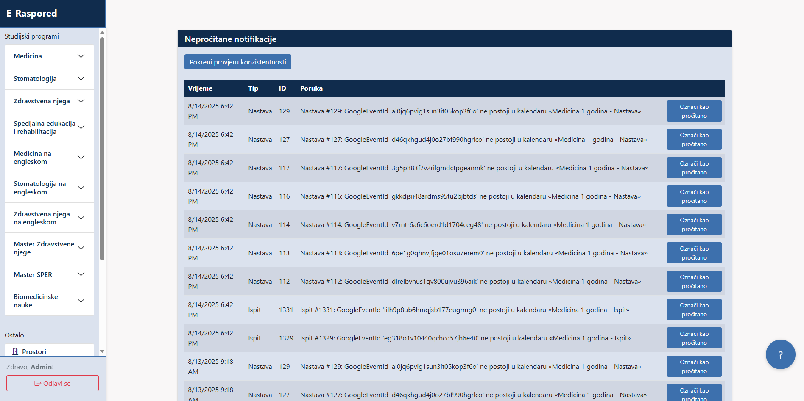
</a>
</td>
<td align="center">

</td>
  <td align="center">
<a href="media/screenshots/06-04-Audit-log.png">
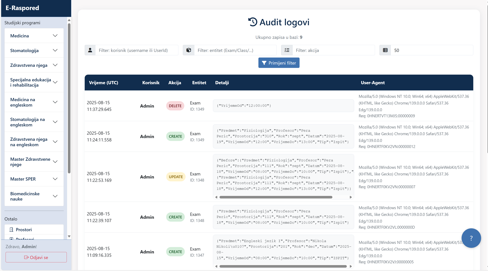
</a>
</td>
</tr>
</tbody>
</table>

More in the **[screenshot gallery](media/screenshots/)**.

---

## 🎥 Quick tour
[▶ Validation - save + calendar exam](media/gif/01-exam-create.gif)  

---

## 🏗️ Architecture

  
<b>1) Overview</b>

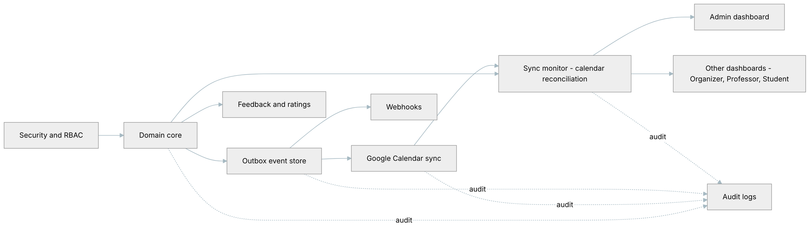

  
<b>2) Core domain</b>

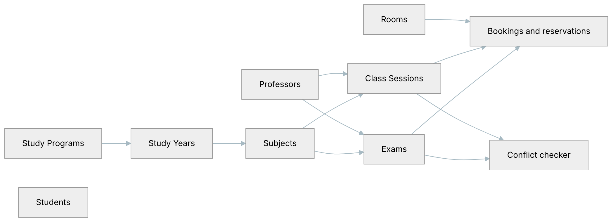

  
<b>3) Integrations & Ops </b>

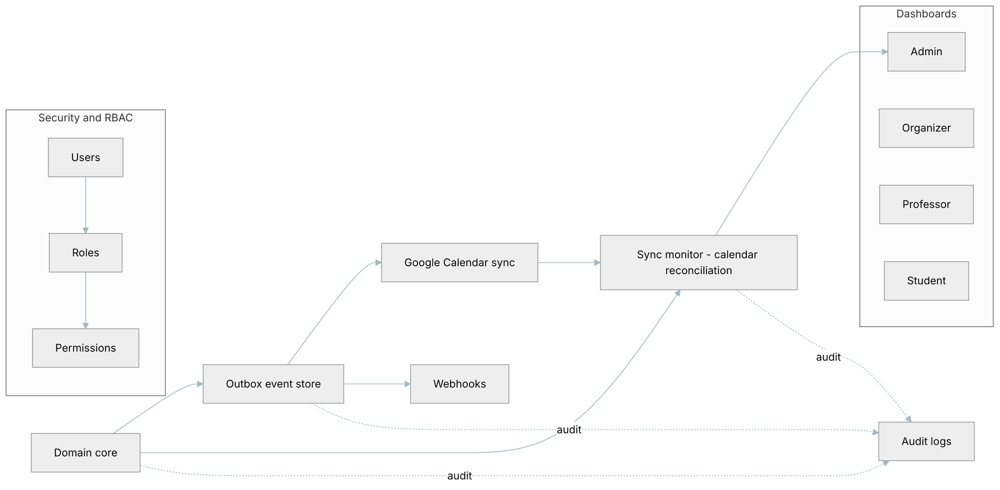

---

## 🔒 Security Highlights
- HTTPS enforced
- Two-factor authentication on Google accounts
- Role-based permissions per module
- Data validation on multiple levels (client, server, database)
- Restricted access to Google Calendar API

---

## 📄 Documentation
- [System Overview](docs/overview.md)
- [Feature List](docs/features.md)
- [Roadmap](docs/roadmap.md)
- [FAQ](docs/faq.md)

---

## 📬 Contact
📧 Email: djordjeradovic94@gmail.com  
🌐 Demo: *(available upon request)*

---

## 📜 License
© 2025 Đorđe Radović. All rights reserved.  
This repository is for presentation purposes only. Unauthorized use, reproduction, or distribution is prohibited.
