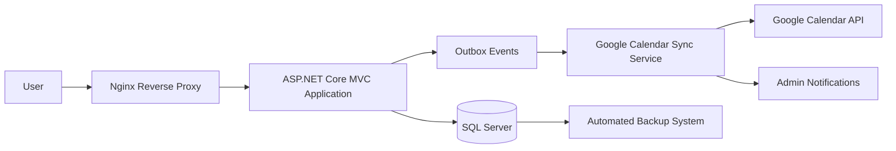
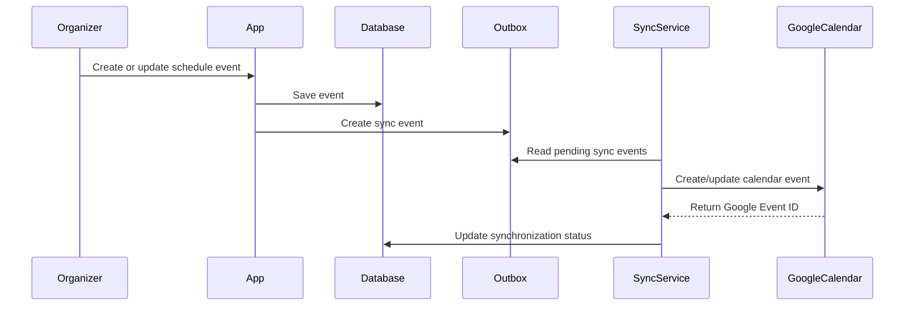
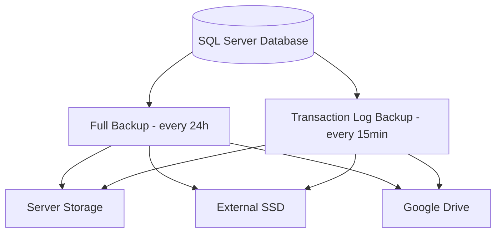

# E-Raspored

**Centralized academic scheduling system for managing classes, exams, rooms, professors, study programs and Google Calendar synchronization.**

> **Public Showcase / Curated Subset**  
> This repository contains documentation, selected screenshots, architecture diagrams and curated code snippets.  
> The full production codebase is private and does not include real institution data, secrets, connection strings or access tokens.

---

## Table of Contents

- [Overview](#1-overview)
- [Key Features](#2-key-features)
- [System Architecture](#3-system-architecture)
- [Engineering Highlights](#4-engineering-highlights)
- [Security and Reliability](#5-security-and-reliability)
- [Results](#6-results)
- [Lessons Learned](#7-lessons-learned)
- [Screenshots](#8-screenshots)
- [Documentation](#9-documentation)
- [Tech Stack](#10-tech-stack)
- [Repository Notice](#11-repository-notice)
- [Contact](#12-contact)
- [License](#license)

---

## 1. Overview

E-Raspored is a centralized scheduling and exam management system built for higher education institutions.

The system solves the problem of managing a large number of academic events across multiple study programs, rooms, professors and student groups. In the previous workflow, scheduling was mostly handled manually, which often caused conflicts between rooms, professors, time slots and study programs.

The platform is designed for an institution with:

- 10+ study programs
- 2,500+ students
- 240+ professors
- 25,000+ academic events per year
- classes, exams, rooms, study groups and calendar synchronization

Besides scheduling, the system also supports anonymous student feedback for evaluating classes and exams.

The main goal was not just to display schedules, but to build a reliable system that prevents conflicts, keeps data synchronized and protects the institution from data loss.

---

## 2. Key Features

- Centralized management of classes and exams
- Conflict detection for rooms, professors and study programs
- Google Calendar synchronization
- Controlled recovery from database or calendar data
- Role-based access control
- Anonymous student feedback for classes and exams
- Admin notifications for synchronization issues
- Audit logs for important administrative actions
- Automated backup strategy with multiple backup locations

---

## 3. System Architecture

E-Raspored is built as an **ASP.NET Core MVC** application with **SQL Server** as the primary database.

The application is hosted on a **Linux server** and runs as a `systemd` service behind an **Nginx reverse proxy**.


```mermaid
flowchart LR
    User[User] --> Nginx[Nginx Reverse Proxy]
    Nginx --> App[ASP.NET Core MVC Application]
    App --> DB[(SQL Server)]
    App --> Outbox[Outbox Events]
    Outbox --> SyncService[Google Calendar Sync Service]
    SyncService --> GCal[Google Calendar API]
    SyncService --> Notifications[Admin Notifications]
    DB --> Backup[Automated Backup System]
```

### Main architectural components

- **ASP.NET Core MVC** - web application, business logic and views
- **SQL Server** - primary data storage
- **ASP.NET Core Identity** - authentication and authorization
- **Nginx** - reverse proxy
- **systemd** - Linux service management
- **Google Calendar API** - external calendar synchronization
- **Outbox pattern** - reliable event synchronization
- **Backup jobs** - full and transaction log backups

---

## 4. Engineering Highlights

### Conflict Detection Engine

One of the most important parts of the system is conflict detection.

Before a schedule event is saved, the system checks whether the selected room, professor or study program is already occupied in the same time interval.

Validation is performed on two levels:

1. **Client-side validation**  
   JavaScript validation gives immediate feedback to the organizer while creating or editing an event.

2. **Server-side validation**  
   The backend performs the final validation using optimized SQL queries before saving data.

The system prevents conflicts such as:

- the same professor assigned to two events at the same time
- the same room used for multiple events at the same time
- the same study program having overlapping classes or exams
- invalid time ranges or incomplete scheduling data

This ensures that the database remains consistent even if client-side validation is bypassed.

---

### Google Calendar Synchronization

The system is integrated with Google Calendar in order to keep academic schedules available outside the application.

When an organizer creates or updates an event, the event is first saved in the local database. After that, an outbox event is created and processed by a background synchronization service.


```mermaid
sequenceDiagram
    participant Organizer
    participant App
    participant Database
    participant Outbox
    participant SyncService
    participant GoogleCalendar

    Organizer->>App: Create or update schedule event
    App->>Database: Save event
    App->>Outbox: Create sync event
    SyncService->>Outbox: Read pending sync events
    SyncService->>GoogleCalendar: Create/update calendar event
    GoogleCalendar-->>SyncService: Return Google Event ID
    SyncService->>Database: Update synchronization status
```

This approach prevents data loss if Google Calendar is temporarily unavailable or if the server does not have internet access at the moment of event creation.

The system also includes a synchronization consistency service that compares local database records with Google Calendar events and notifies administrators if differences are detected.

---

### Backup and Recovery Strategy

Because the system manages important academic schedules, backup and recovery were treated as a core part of the architecture.

The backup strategy includes:

- full database backup every 24 hours
- transaction log backup every 15 minutes
- backup copies stored on multiple locations
- local server backup
- external SSD backup
- Google Drive backup
- Google Calendar recovery strategy


```mermaid
flowchart TD
    DB[(SQL Server Database)] --> FullBackup[Full Backup - every 24h]
    DB --> LogBackup[Transaction Log Backup - every 15min]

    FullBackup --> Server[Server Storage]
    FullBackup --> SSD[External SSD]
    FullBackup --> GDrive[Google Drive]

    LogBackup --> Server
    LogBackup --> SSD
    LogBackup --> GDrive
```

In case of inconsistency between the database and Google Calendar, the system includes controlled recovery methods for pulling events either from the database or from Google Calendar, depending on the failure scenario.

---

### Permissions and Roles

The system uses ASP.NET Core Identity for authentication and role-based authorization.

Main roles:

- **Admin**
- **Organizer**
- **Professor**
- **Student**

Each organizer can manage only the study programs assigned to them. This prevents unauthorized changes across departments or study programs.

Examples:

- students can only view their own schedules and submit feedback
- professors can view their own classes and exams
- organizers can create and edit events for assigned study programs
- admins can manage users, permissions, synchronization and audit logs

This keeps the system safe and organized in a multi-user academic environment.

---

## 5. Security and Reliability

Security was implemented across multiple layers of the system.

### Authentication and Authorization

- ASP.NET Core Identity
- role-based authorization
- restricted access by user role
- organizer permissions limited by assigned study program

### Data Validation

- client-side validation for better user experience
- server-side validation for data integrity
- database-level consistency rules
- conflict checks before saving events

### Audit Logs

Important administrative actions are recorded through audit logs.

Audit logs help track:

- user management changes
- schedule modifications
- synchronization actions
- administrative operations

### Reliability

The system was designed to continue working even when external services are temporarily unavailable.

For example, if Google Calendar is not reachable, the event remains safely stored in the database and the outbox service can synchronize it later.

---

## 6. Results

E-Raspored replaced a manual and fragmented scheduling workflow with a centralized platform for academic event management.

### Project highlights

- supports 2,500+ students
- supports 10+ study programs
- manages 25,000+ academic events per year
- prevents conflicts between rooms, professors and study programs
- synchronizes academic schedules with Google Calendar
- includes automatic backup and recovery strategy
- supports role-based access for admins, organizers, professors and students
- includes anonymous student feedback for classes and exams

---

## 7. Lessons Learned

The most challenging part of the project was not building the user interface, but maintaining data consistency between the local database, Google Calendar and backup system.

The project required careful handling of several real-world scenarios:

- what happens if Google Calendar is unavailable
- what happens if an event is saved locally but not synchronized
- how to detect differences between local data and external calendar data
- how to recover from database or calendar inconsistency
- how to prevent schedule conflicts before they enter the system
- how to protect data with full and transaction log backups

This project helped me understand that production software is not only about features. It is also about reliability, permissions, recovery, synchronization, data integrity and long-term maintainability..

---

## 8. Screenshots

Screenshots are available in the `images/` folder.

Suggested screenshots:

- 
- Schedule view
- Exam creation
- Student dashboard
- Google Calendar sync panel
- Admin notifications
- Audit logs
- Mobile views

Example:

```md


```

---

## 9. Documentation

Additional documentation can be found in the `docs/` folder.

Suggested structure:

```text
docs/
├── architecture.md
├── database.md
├── security.md
├── backup-strategy.md
├── google-calendar-sync.md
├── conflict-detection.md
└── deployment.md
```

Recommended documents:

- **architecture.md** — system architecture and main modules
- **database.md** — main entities and relationships
- **security.md** — authentication, authorization and permissions
- **backup-strategy.md** — full backup, transaction log backup and recovery scenarios
- **google-calendar-sync.md** — synchronization flow and consistency checks
- **conflict-detection.md** — conflict detection logic
- **deployment.md** — Linux hosting, Nginx and systemd setup

---

## 10. Tech Stack

- ASP.NET Core MVC
- Entity Framework Core
- SQL Server
- ASP.NET Core Identity
- Google Calendar API
- JavaScript / jQuery
- Bootstrap
- Linux
- Nginx
- systemd

---

## 11. Repository Notice

This repository is a public case study and documentation showcase.

It does not contain:

- production secrets
- access tokens
- real user data
- real student data
- private institution configuration
- full production source code

Selected code snippets may be included only for demonstration purposes.

Suggested repository structure:

```text
E-Raspored/
├── README.md
├── docs/
│   ├── architecture.md
│   ├── database.md
│   ├── security.md
│   ├── backup-strategy.md
│   ├── google-calendar-sync.md
│   ├── conflict-detection.md
│   └── deployment.md
├── images/
│   ├── dashboard.png
│   ├── schedule.png
│   ├── exam-create.png
│   ├── student-dashboard.png
│   ├── google-calendar-sync.png
│   └── audit-logs.png
├── snippets/
│   ├── conflict-detection.cs
│   ├── google-calendar-outbox-sync.cs
│   ├── backup-job.sql
│   └── authorization-policy.cs
└── LICENSE
```

---

## 12. Contact

**Đorđe Radović**

Email: djordjeradovic94@gmail.com

Demo available upon request.

---

## License

© Đorđe Radović. All rights reserved.

This repository is for portfolio and presentation purposes only. Unauthorized use, reproduction or distribution is prohibited.