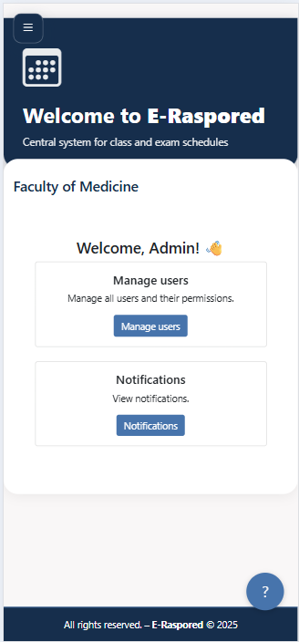
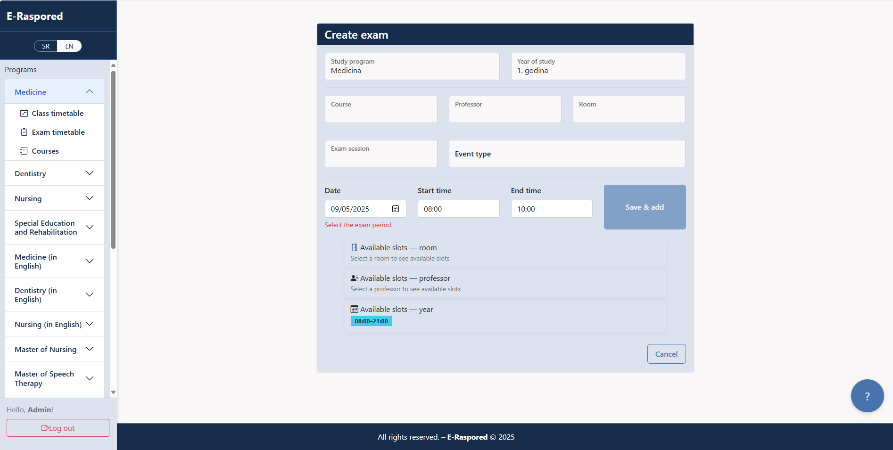
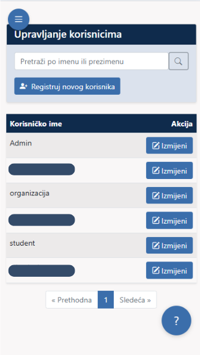

# E-Raspored — Scheduling that prevents conflicts

E-Raspored is an academic scheduling and exam management system that helps institutions plan classes and exams faster, track room/lecturer workload, and keep everyone synced via Google Calendar integration.

> **Public Showcase / Curated Subset**
>
> This repository contains a **curated public subset** of the project (selected code modules, docs, screenshots, and examples).  
> The full production codebase is **private/proprietary** and includes additional modules, internal configuration, and institution-specific details.

✅ No secrets (keys, connection strings, tokens) are included.  
✅ No real institution data is included.  
✅ Some implementation details are intentionally omitted.

---

## Who this is for & what problem it solves

E-Raspored is built for three groups:

- **Scheduling office / administrators** — build timetables and exam sessions faster, detect room conflicts and lecturer workload at a glance, and coordinate changes safely.
- **Teaching staff** — view only your own classes/exams, see room & group assignments, and get notified when something changes.
- **Students** — access a personalized timetable (year/group), upcoming exams, and submit quick feedback on courses and exam sessions.

**Goal:** reduce manual work, prevent scheduling conflicts, and make schedules transparent for everyone.

---

## Who this is for & what problem it solves

E-Raspored is built for three groups:

- **Scheduling office / administrators** — build timetables and exam sessions faster, detect room conflicts and lecturer workload at a glance, and coordinate changes safely.
- **Teaching staff** — view only your own classes/exams, see room & group assignments, and get notified when something changes.
- **Students** — access a personalized timetable (year/group), upcoming exams, and submit quick feedback on courses and exam sessions.

**Goal:** reduce manual work, prevent scheduling conflicts, and make schedules transparent for everyone.

---

## 📈 Adoption (Production Use)
- 10+ study programs
- 2,500+ students, 240+ professors
- Thousands of scheduled events per semester

## 🚀 Key Features
- Centralized scheduling for classes and exams
- Conflict detection for rooms and time slots
- Two-way synchronization with Google Calendar
- Role-based access control (Admin / Organizer / Professor / Student)
- Client-side and server-side validation
- Notifications for admin
- Student feedback and rating for classes and exams
---

## 🖥️ Technologies (Production Version)
- ASP.NET Core (MVC + API)
- Entity Framework Core (SQL)
- Google Calendar API
- Bootstrap 5 (responsive UI)
- jQuery/JavaScript form validation

---

## 📸 Screenshots

<b>📊 Dashboard - click to expand</b>

 

<table>
<thead>
<tr>
<th align="center">Dashboard - Desktop</th>
<th align="center">Dashboard - Mobile</th>
</tr>
</thead>
<tbody>
<tr>
<td align="center">

</td>
<td align="center">

</td>
</tr>
</tbody>
</table>

<b>📅 Schedule - click to expand</b>

 

<table>
<thead>
<tr>
<th align="center">Schedule - Desktop</th>
<th align="center">Schedule - Mobile</th>
</tr>
</thead>
<tbody>
<tr>
<td align="center">

</td>
<td align="center">

</td>
</tr>
</tbody>
</table>

<b>📠Exam - click to expand</b>

 

<table>
<thead>
<tr>
<th align="center">Exam Create - Desktop</th>
<th align="center">Exam Options - Mobile</th>
</tr>
</thead>
<tbody>
<tr>
<td align="center">

</td>
<td align="center">

</td>
</tr>
</tbody>
</table>

<b>🧑‍🎓 Student - click to expand</b>

 

<table>
<thead>
<tr>
<th align="center">Student Dashboard - Desktop</th>
<th align="center">Student HelpWidget - Mobile</th>
</tr>
</thead>
<tbody>
<tr>
<td align="center">

</td>
<td align="center">

</td>
</tr>
</tbody>
</table>

<b>🖨️ Print - click to expand</b>

 

<table>
<thead>
<tr>
<th align="center">Print - Desktop</th>
</tr>
</thead>
<tbody>
<tr>
<td align="center">

</tr>
</tbody>
</table>

<b>🛡️ Admin - click to expand</b>

 

<table>
<thead>
<tr>
<th align="center">Admin Sync GCalendar - Desktop</th>
<th align="center">Admin Notifications - Desktop</th>
<th align="center">Admin Manage Users - Mobile</th>
  <th align="center">Admin Audit Logs - Desktop</th>
</tr>
</thead>
<tbody>
<tr>
<td align="center">

</td>
  <td align="center">

</td>
<td align="center">

</td>
  <td align="center">

</td>
</tr>
</tbody>
</table>

More in the **[screenshot gallery](media/screenshots/)**.

---

## 🎥 Quick tour
[▶ Watch the full 1:05 demo (MP4)(download link)](https://github.com/djole994/E-Raspored-docs/releases/download/v0.1.0/E-Raspored.mp4)

[▶ Validation - save + calendar exam](media/gif/01-exam-create.gif)  

---

## 🏗️ Architecture

  
<b>1) Overview</b>

  
<b>2) Core domain</b>

  
<b>3) Integrations & Ops </b>

---

## 🔒 Security Highlights
- HTTPS enforced
- Two-factor authentication on Google accounts
- Role-based permissions per module
- Data validation on multiple levels (client, server, database)
- Restricted access to Google Calendar API

---

## 📄 Documentation
- [System Overview](docs/overview.md)
- [Feature List](docs/features.md)
- [Roadmap](docs/roadmap.md)
- [FAQ](docs/faq.md)

---

## 📬 Contact
📧 Email: djordjeradovic94@gmail.com  
🌐 Demo: *(available upon request)*

---

## 📜 License
© 2025 Đorđe Radović. All rights reserved.  
This repository is for presentation purposes only. Unauthorized use, reproduction, or distribution is prohibited.
