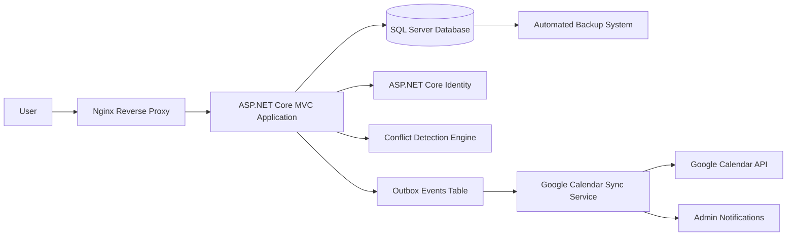
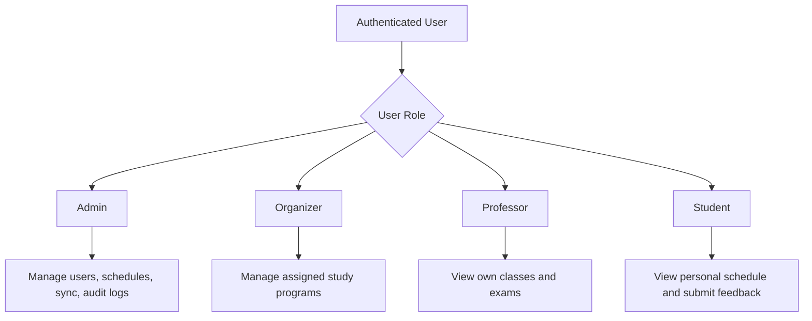
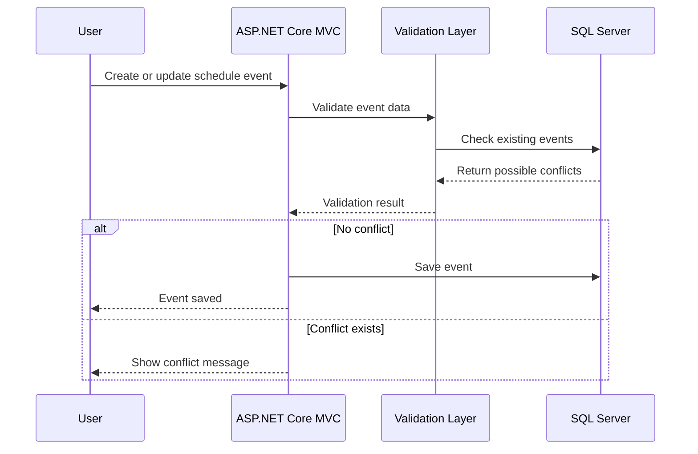
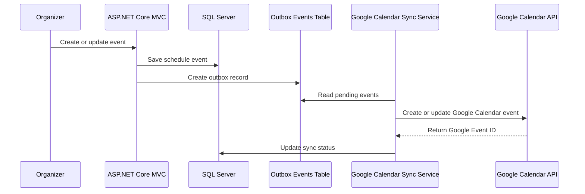
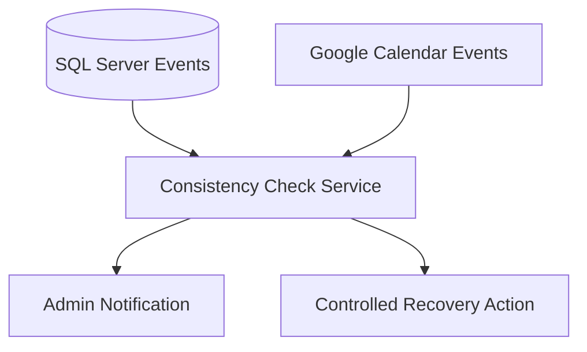
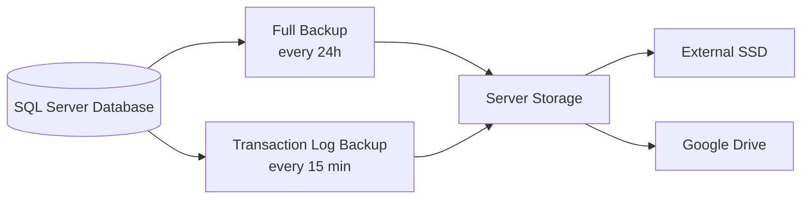
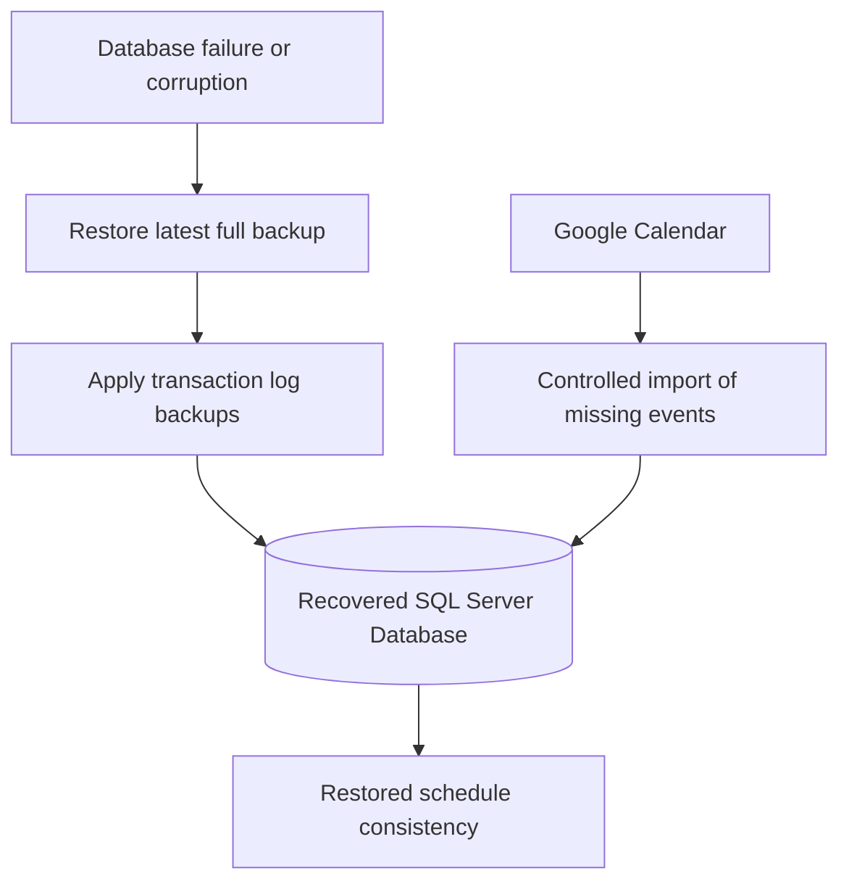
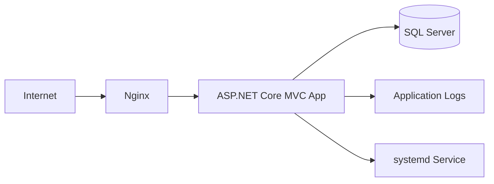

# System Architecture

This document explains the high-level architecture of **E-Raspored**, its main modules, data flow and integration with external services.

---

## 1. Architecture Overview

E-Raspored is built as an **ASP.NET Core MVC** application with **SQL Server** as the primary data store.

The application is hosted on a **Linux server**, runs as a `systemd` service and is exposed through an **Nginx reverse proxy**.

The system is designed around one main rule:

> SQL Server is the primary source of truth.  
> Google Calendar is used for synchronization, visibility and controlled recovery of synchronized events.

---

## 2. Main Modules

### Scheduling Module

The scheduling module manages academic events such as:

- classes
- exams
- room reservations
- professor assignments
- study program schedules
- student group schedules

Every event is connected to a study program, professor, room and time interval.

Before an event is saved, the system checks whether it conflicts with existing events.

---

### Conflict Detection Engine

The conflict detection engine prevents invalid schedule entries.

It checks conflicts between:

- rooms
- professors
- study programs
- student groups
- time intervals

Validation is performed on two levels:

1. **Client-side validation**  
   Provides immediate feedback to the organizer while creating or editing an event.

2. **Server-side validation**  
   Performs the final validation before saving the event to the database.

Server-side validation is always treated as the authoritative validation layer.

---

### Identity and Role-Based Access Control

The system uses **ASP.NET Core Identity** for authentication and authorization.

Main roles:

- Admin
- Organizer
- Professor
- Student

Each role has different permissions.

Organizers can manage only the study programs assigned to them.  
This prevents unauthorized changes across different departments or study programs.

---

## 3. Data Flow

The basic request flow looks like this:

This ensures that schedule conflicts are detected before they enter the database.

---

## 4. Google Calendar Synchronization

Google Calendar synchronization is handled through an **outbox pattern**.

The application does not depend on Google Calendar being available at the exact moment when an organizer creates or updates an event.

Instead, the event is first saved in SQL Server.  
Then an outbox record is created and processed later by the synchronization service.

This approach improves reliability because:

- the schedule event is safely stored before external synchronization
- temporary internet problems do not block event creation
- failed synchronization can be retried
- Google Calendar Event IDs are stored for future updates
- administrators can be notified about synchronization issues

---

## 5. Synchronization Consistency

The system includes a consistency check between SQL Server and Google Calendar.

The consistency service can detect cases where:

- an event exists in SQL Server but not in Google Calendar
- an event exists in Google Calendar but is missing in SQL Server
- event time differs between SQL Server and Google Calendar
- Google Calendar synchronization failed
- Google Calendar Event ID is missing or invalid

When a mismatch is detected, the system can notify administrators and allow controlled recovery actions.

---

## 6. Backup and Recovery Architecture

The system uses a multi-layer backup strategy.

Backup destinations:

- server storage
- external SSD
- Google Drive

The system keeps both:

- full database backups
- transaction log backups

This allows recovery from the latest full backup and reduces possible data loss by using transaction log backups.

---

## 7. Google Calendar-Assisted Recovery

Google Calendar is not the primary backup system.

The primary source of truth is SQL Server.

However, because academic events are synchronized with Google Calendar, the system can use Google Calendar as an auxiliary recovery source in specific failure scenarios.

Example recovery scenario:

This can help recover synchronized events created or updated during the affected time period.

Google Calendar is used only as a controlled recovery source, not as the main database.

---

## 8. Audit Logs

Important administrative and system actions are recorded in audit logs.

Audit logs can include:

- user management changes
- schedule modifications
- permission changes
- synchronization actions
- failed synchronization attempts
- recovery actions

Audit logs help administrators understand what happened in the system and when.

---

## 9. Deployment Architecture

The production deployment uses a Linux-based hosting environment.

Main deployment components:

- Linux server
- Nginx reverse proxy
- ASP.NET Core MVC application
- systemd service
- SQL Server
- automated backup jobs
- application logs

---

## 10. Architectural Decisions

### SQL Server as the primary source of truth

SQL Server stores all core scheduling data, users, permissions, synchronization state and audit logs.

Google Calendar is not used as the main database.

---

### Outbox pattern for external synchronization

The system uses an outbox table to make Google Calendar synchronization more reliable.

This prevents data loss when Google Calendar or the internet connection is temporarily unavailable.

---

### Server-side validation as the final authority

Client-side validation improves user experience, but server-side validation is responsible for protecting data integrity.

No schedule event should be saved without backend validation.

---

### Role-based access control

The system separates responsibilities between admins, organizers, professors and students.

This keeps the application secure and easier to manage in a multi-user academic environment.

---

## 11. Summary

E-Raspored is designed as a production-oriented academic scheduling system.

The architecture focuses on:

- data consistency
- conflict prevention
- controlled synchronization
- backup and recovery
- role-based access
- auditability
- maintainability

The main engineering challenge was not only building the scheduling interface, but ensuring that schedule data remains correct, synchronized and recoverable in real-world failure scenarios.