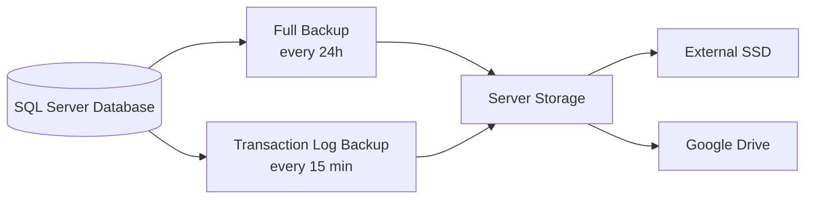
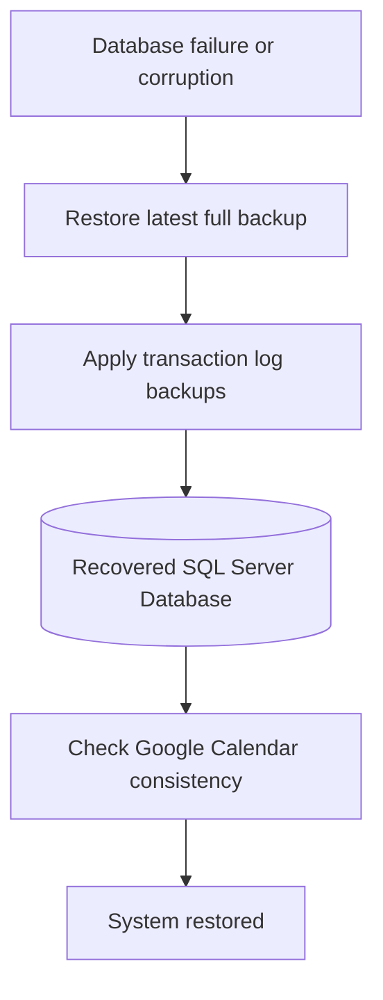
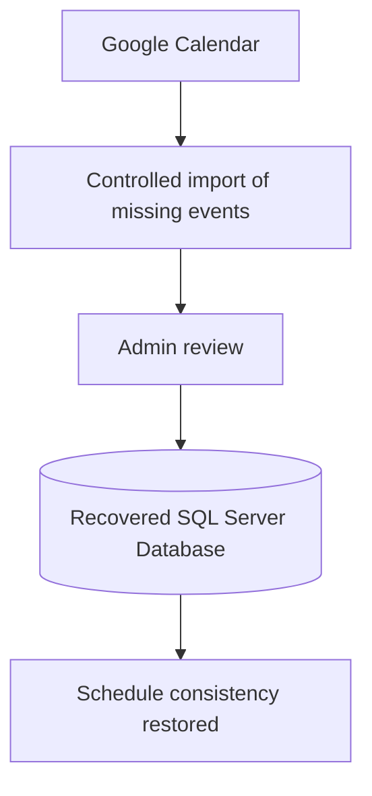

# Backup Strategy

This document describes the backup and recovery strategy used in **E-Raspored**.

Because the system manages academic schedules, exams and Google Calendar synchronization data, backup and recovery are treated as a core part of the system reliability.

---

## 1. Backup Goals

The backup strategy is designed to:

- protect the SQL Server database
- reduce possible data loss
- support recovery after database failure or corruption
- keep backup copies in multiple locations
- support recovery of synchronized calendar events when needed

---

## 2. Database Backup Strategy

The system uses two types of SQL Server backups:

- **Full Backup** - every 24 hours
- **Transaction Log Backup** - every 15 minutes

Full backups provide a complete database copy.  
Transaction log backups reduce potential data loss by allowing recovery closer to the moment before failure.

---

## 3. Backup Locations

Backup files are stored in multiple locations:

- server storage
- external SSD
- Google Drive

This reduces the risk of losing backups if one storage location becomes unavailable.

---

## 4. Recovery Scenario

In case of database failure, the recovery process is:

1. restore the latest full database backup
2. apply available transaction log backups
3. verify restored data
4. check synchronization state with Google Calendar
5. recover missing synchronized events if needed

---

## 5. Google Calendar-Assisted Recovery

Google Calendar is not the primary backup system.

The primary source of truth is **SQL Server**.

However, because schedule events are synchronized with Google Calendar, the system can use Google Calendar as an auxiliary recovery source.

This can be useful when:

- the database was restored from backup
- some events were created after the last valid backup
- Google Calendar still contains synchronized events from the affected period
- local and calendar data need to be compared

---

## 6. Important Notes

- SQL Server remains the primary source of truth.
- Google Calendar is used only as an additional recovery source for synchronized events.
- Backup files should not contain secrets in public repositories.
- Production backup paths, credentials and tokens are not included in this repository.
- Recovery actions should be reviewed before being applied to production data.

---

## 7. Summary

The backup strategy combines:
- full database backups
- transaction log backups
- multiple backup locations
- Google Calendar-assisted event recovery

The goal is to reduce data loss and keep the scheduling system recoverable in real-world failure scenarios.