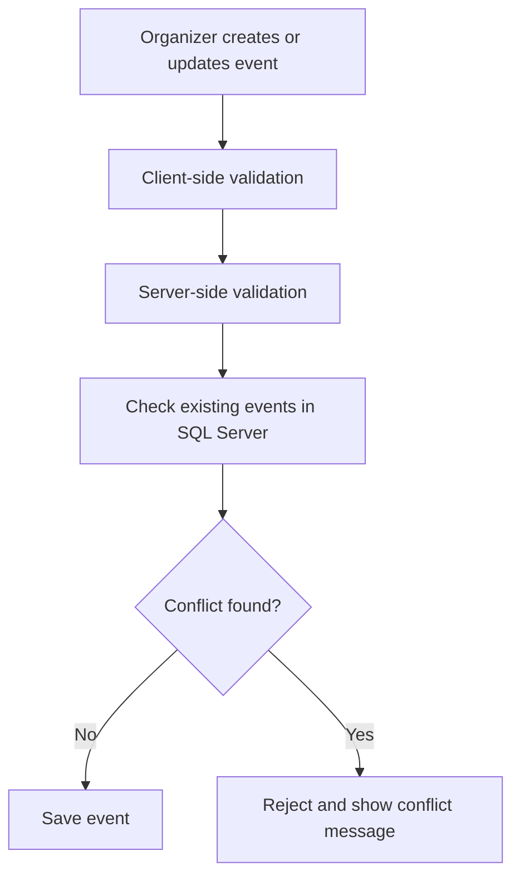

# Conflict Detection

This document describes how **E-Raspored** prevents scheduling conflicts between professors, rooms, study programs and time intervals.

Conflict detection is one of the core parts of the system because it protects the schedule from invalid or overlapping events.

---

## 1. Goal

The goal of conflict detection is to prevent situations where:

- one professor is assigned to multiple events at the same time
- one room is used for multiple events at the same time
- one study program has overlapping classes or exams
- an event has an invalid time range
- an organizer creates a schedule entry outside allowed rules

---

## 2. Validation Layers

The system uses two validation layers.

### Client-Side Validation

Client-side validation is used for fast feedback while the organizer is creating or editing an event.

It helps detect obvious conflicts before the form is submitted.

### Server-Side Validation

Server-side validation is the final authority.

Even if client-side validation is bypassed, the backend checks all important rules again before saving the event to the database.

```text
Client-side validation = better user experience
Server-side validation = data integrity
```

---

## 3. Conflict Checks

Before saving a class or exam, the system checks:

- selected professor availability
- selected room availability
- study program availability
- student group availability
- start and end time
- existing events in the same time interval

The system compares the new event with existing events in the database.

---

## 4. Basic Conflict Logic

Two events are considered overlapping when they use the same resource and their time intervals overlap.

```text
New event:
StartTime < ExistingEvent.EndTime
AND
EndTime > ExistingEvent.StartTime
```

This rule is used for checking conflicts between:

- rooms
- professors
- study programs
- student groups

---

## 5. Simplified Flow



---

## 6. Example Conflicts

The system blocks examples such as:

- Professor already has another class at the same time
- Room is already reserved for another exam
- Study program already has scheduled teaching in the same time slot
- Exam overlaps with another exam for the same group
- End time is before start time

---

## 7. SQL Optimization

Conflict checks are performed with optimized database queries.

The goal is to check only relevant events:

- same professor
- same room
- same study program
- same date or time range
- active events only

This keeps validation efficient even when the system contains a large number of scheduled events.

---

## 8. Summary

Conflict detection protects the system from invalid schedule data.

The main principles are:

- validate before saving
- check conflicts on the server
- use SQL Server as the source of truth
- prevent overlapping use of rooms, professors and study programs
- show clear messages when a conflict is detected

This ensures that the academic schedule remains consistent and reliable.