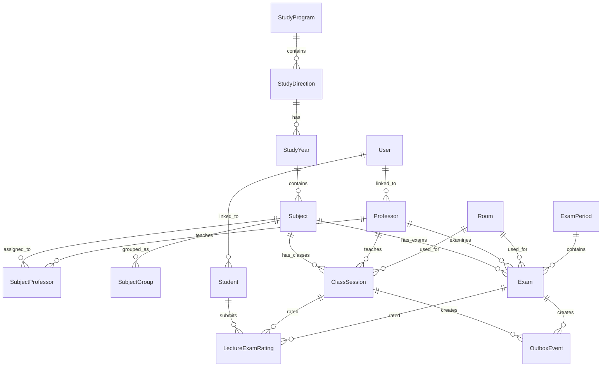

# Database Design

This document describes the main database entities used in **E-Raspored** and their relationships.

The system uses **SQL Server** as the primary database.  
Core scheduling data, users, roles, permissions, synchronization state, notifications and audit logs are stored in the database.

---

## 1. Main Entity Groups

The database is organized around several main areas.

---

## Academic Structure

These entities define the academic organization of the institution:

- `StudyProgram`
- `StudyDirection`
- `StudyYear`
- `Subject`
- `SubjectGroup`

They describe study programs, directions, academic years, subjects and subject groups.

Example:

```text
StudyProgram
  └── StudyDirection
        └── StudyYear
              └── Subject
```

---

## People

These entities store users involved in the scheduling process:

- `Student`
- `Professor`
- `User`

`User` is managed through ASP.NET Core Identity and is used for authentication and authorization.

A user can be connected to a student or professor profile depending on their role.

---

## Scheduling

These are the core scheduling entities:

- `ClassSession`
- `Exam`
- `ExamPeriod`
- `Room`

They store classes, exams, exam periods and rooms.

Each scheduled event is connected with:

- subject
- professor
- room
- study program / group
- date and time interval

---

## Teaching Assignments

These entities define relationships between subjects, professors and groups:

- `SubjectProfessor`
- `SubjectGroup`

They are used to define which professors are assigned to specific subjects and which groups are connected to a subject.

---

## Google Calendar Synchronization

These entities support synchronization with Google Calendar:

- `CalendarConfiguration`
- `SynchronizationSettings`
- `OutboxEvent`

`OutboxEvent` is used for reliable synchronization.

When a class or exam is created or updated, the change is first stored in the database.  
After that, an outbox record is created and processed by the synchronization service.

This allows the system to continue working even if Google Calendar is temporarily unavailable.

---

## Notifications and Audit Logs

These entities support monitoring and administration:

- `Notification`
- `AuditLog`

`Notification` stores system and administrator notifications.

`AuditLog` stores important actions such as:

- schedule changes
- user management changes
- permission changes
- Google Calendar synchronization actions
- recovery actions

---

## Student Feedback

The system supports anonymous student feedback through:

- `LectureExamRating`

This entity stores feedback and ratings related to classes and exams.

---

## 2. High-Level Relationship Diagram



---

## 3. Core Entity Overview

### StudyProgram

Represents a study program within the institution.

Examples:

- Medicine
- Dentistry
- Nursing
- Special education programs

A study program can have multiple directions, years, subjects and student groups.

---

### StudyDirection

Represents a direction or track inside a study program.

It is used when a study program has multiple internal paths or variants.

---

### StudyYear

Represents the academic year within a study program or direction.

Examples:

- First year
- Second year
- Third year

---

### Subject

Represents a course or academic subject.

A subject can be connected with:

- study year
- professors
- student groups
- class sessions
- exams

---

### Professor

Represents teaching staff.

Professors can be assigned to:

- subjects
- classes
- exams

The system checks professor availability before allowing a new class or exam to be scheduled.

---

### Student

Represents a student profile.

Students can view their schedule and submit anonymous feedback for classes and exams.

---

### Room

Represents a classroom, lecture hall, laboratory or exam room.

The system checks room availability before saving a class or exam.

---

### ClassSession

Represents a scheduled class, lecture, practical session or other teaching activity.

A class session usually contains:

- subject
- professor
- room
- date
- start time
- end time
- study program or group

---

### Exam

Represents a scheduled exam.

An exam is connected with:

- subject
- professor
- exam period
- room
- date and time

---

### ExamPeriod

Represents an official exam period.

Examples:

- January exam period
- April exam period
- June exam period

---

### OutboxEvent

Represents a pending synchronization action.

It is used when a local database change needs to be synchronized with Google Calendar.

Typical outbox event types:

- create calendar event
- update calendar event
- delete calendar event
- retry failed synchronization

---

### AuditLog

Stores important system actions for traceability and administration.

---

### Notification

Stores system notifications, mostly related to synchronization issues, errors or administrative alerts.

---

### LectureExamRating

Stores anonymous student feedback and ratings for classes and exams.

---

## 4. Identity Tables

Authentication and authorization are handled through ASP.NET Core Identity.

Main Identity entities:

- `User`
- `Role`
- `UserRole`
- `UserClaim`
- `RoleClaim`
- `UserLogin`
- `UserToken`

The application uses role-based access control for:

- Admin
- Organizer
- Professor
- Student

---

## 5. Scheduling Consistency

Before saving classes or exams, the system checks for conflicts between:

- professor availability
- room availability
- study program schedule
- student group schedule
- time intervals

This helps prevent invalid scheduling records from being saved in the database.

The database remains the primary source of truth for all academic scheduling data.

---

## 6. Google Calendar Relationship

Google Calendar is used for synchronization and visibility, but it is not the primary database.

The system stores Google Calendar synchronization metadata in the database, such as:

- Google Calendar event ID
- synchronization status
- last synchronization attempt
- error information if synchronization fails

This allows the system to track whether local events are correctly synchronized with external calendars.

---

## 7. Notes

The real production database uses localized table names, but this documentation uses English entity names for clarity and public presentation.

SQL Server remains the primary source of truth.

Google Calendar is used only for synchronization, visibility and controlled recovery of synchronized events.