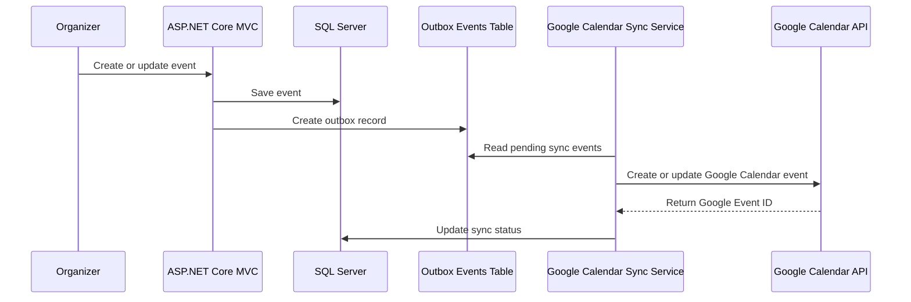
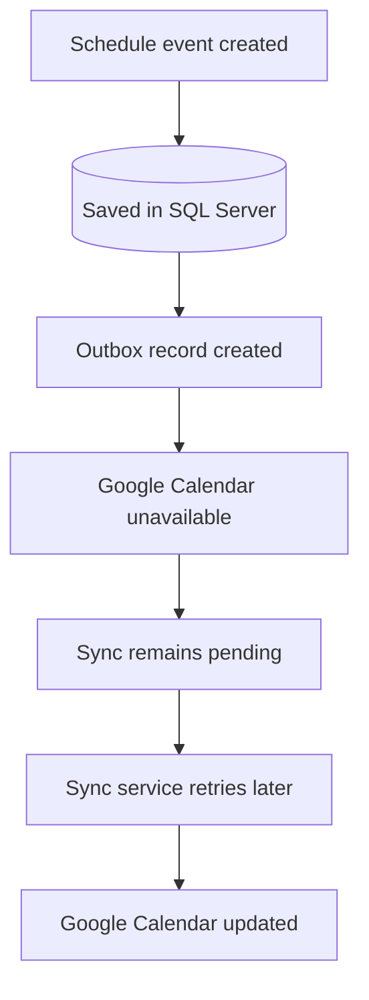
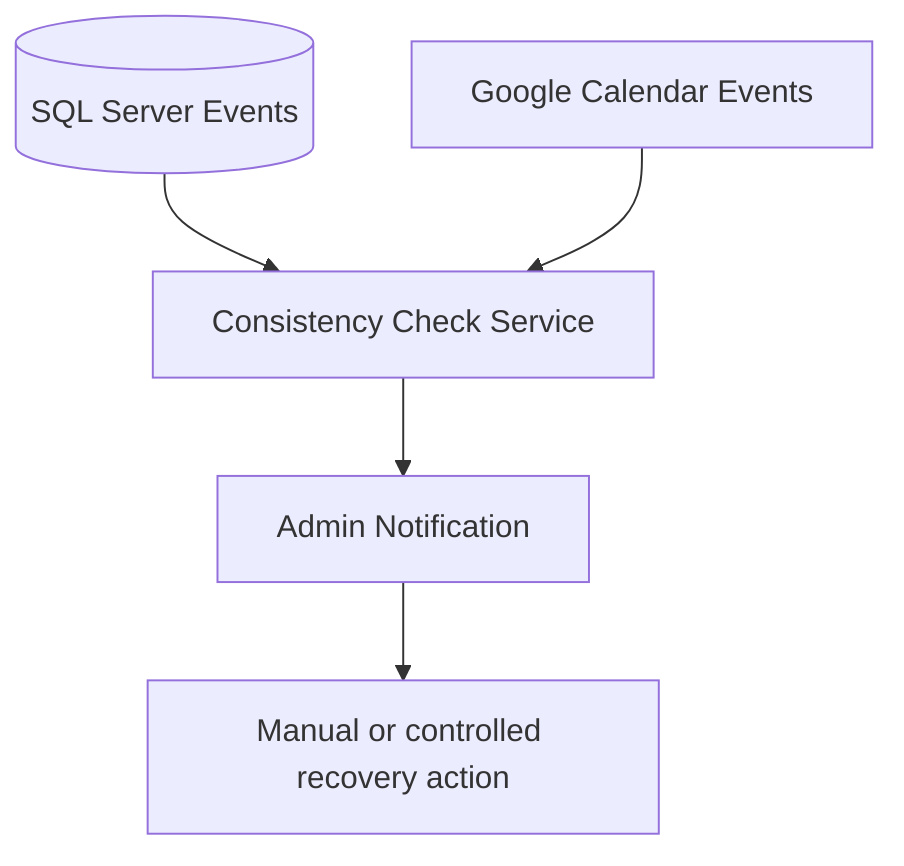

# Google Calendar Synchronization

This document describes how **E-Raspored** synchronizes academic events with Google Calendar and how the system checks synchronization consistency.

Google Calendar is used for external visibility and personal calendar access, while **SQL Server remains the primary source of truth**.

---

## 1. Synchronization Goal

The goal of Google Calendar synchronization is to keep academic events available outside the application.

The system synchronizes:

- classes
- exams
- schedule changes
- event updates
- event cancellations

This allows students and professors to see academic obligations directly in their personal calendars.

---

## 2. Source of Truth

The primary source of truth is always the local SQL Server database.

Google Calendar is not used as the main database.

```text
SQL Server = primary source of truth
Google Calendar = synchronized external calendar
```

All schedule changes are first saved locally, then synchronized with Google Calendar.

---

## 3. Synchronization Flow

When an organizer creates or updates a schedule event, the system does not depend on Google Calendar being available immediately.

Instead, the change is saved locally and synchronization is handled in the background.



---

## 4. Outbox Pattern

The system uses an **Outbox Events** table to make synchronization more reliable.

When an event is created or updated:

1. the event is saved in SQL Server
2. an outbox record is created
3. the background sync service reads pending outbox records
4. the event is sent to Google Calendar
5. the synchronization status is updated in the database

This prevents data loss if Google Calendar or internet access is temporarily unavailable.

---

## 5. Offline / Failure Scenario

If Google Calendar is not available at the moment of event creation, the event remains safely stored in SQL Server.

The outbox record stays pending until the sync service can process it.



---

## 6. Consistency Checks

The system includes consistency checks between SQL Server and Google Calendar.

The consistency service can detect:

- local event missing in Google Calendar
- Google Calendar event missing in local database
- different event time
- missing Google Calendar Event ID
- failed synchronization
- outdated calendar event

When inconsistency is detected, the system can notify administrators.



---

## 7. Stored Synchronization Data

The database stores synchronization metadata such as:

- Google Calendar Event ID
- synchronization status
- last sync attempt
- error message if sync fails
- event version or update timestamp

This allows the system to track whether each local event is correctly synchronized.

---

## 8. Recovery Support

Google Calendar can also be used as an auxiliary recovery source.

If the database is restored from backup and some synchronized events are missing, the system can compare the recovered database with Google Calendar and import missing events for a controlled time period.

Google Calendar is used only as a recovery aid, not as the main database.

---

## 9. Summary

The synchronization design is based on:

- SQL Server as the primary source of truth
- Google Calendar as an external synchronized calendar
- Outbox pattern for reliable sync
- background synchronization service
- retry mechanism for failed sync
- consistency checks
- admin notifications
- controlled recovery support

This makes synchronization safer and more reliable in real-world failure scenarios.